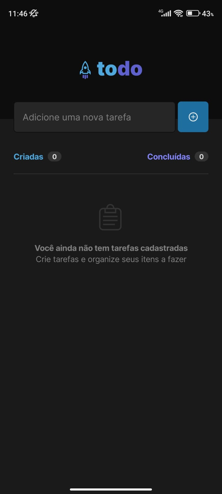
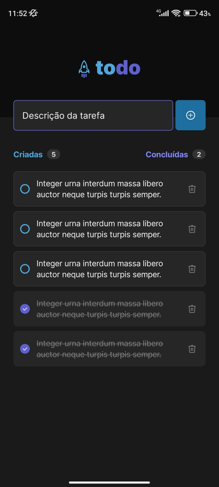

<h1 align="center">
  ToDo List Android
</h1>

  
  

## 💻 Sobre o projeto

Este app ToDo List foi desenvolvido com o objetivo de colocar em prática o desenvolvimento Android,
utilizando o mais recente kit de ferramentas: o Jetpack Compose. Apesar de sua simplicidade, ele
emprega os principais conceitos dessa nova abordagem, como estados, composição, listas e sua
interface declarativa. A ideia foi realizar tudo da maneira mais simples possível, porém, a criação
deste aplicativo proporcionou-me valiosos aprendizados.

## ⚙️ Funcionalidades

- Criação de tarefas
- Listagem de tarefas
- Remoção de tarefas

## 🛠 Tecnologias

As seguintes ferramentas foram usadas na construção do projeto:

- Kotlin
- Jetpack Compose

## 💡 O que eu aprendi

- Utilizar a nova abordagem de interface declarativa do Jetpack Compose (estados, composable)
- Manipulação de lista (Lazy List)
- Usar os componentes mais comuns, como: Text, Button, BasicTextField, Row, Column
- Criar tema personalizado no Material Design

## 🚀 Como executar o projeto

1. Antes de tudo tenha certeza que você tem o ambiente java configurado na sua máquina.
2. Depois clone o projeto
3. Agora basta abrir o projeto no Android Studo e rodar
